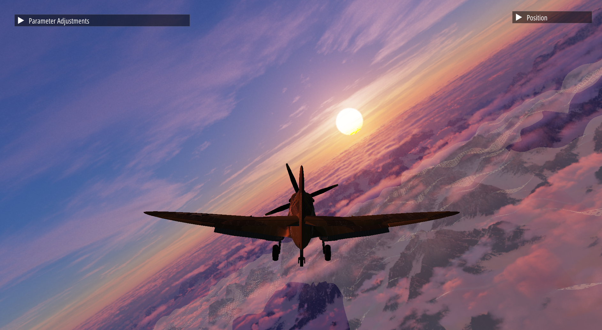

# TCD_RealtimeAnimation_A1
Assignment 1 for Realtime Animation at Trinity College Dublin: Plane rotations

<table>
  <tr>
    <td></td>
    <td></td>
  </tr>
</table>

Written in OpenGL C++. Shaders written in GLSL.

The assignment (and video below) includes a demonstration of gimbal lock using Euler angles, overcoming it using quaternions, free flying around the scene using a quaternion based camera movement, toggling between 1st and 3rd person perspectives, and modifying lighting parameters to make the scene more appealing (using IMGUI).

YouTube demo video: https://www.youtube.com/watch?v=bGt7S5pHhe0
